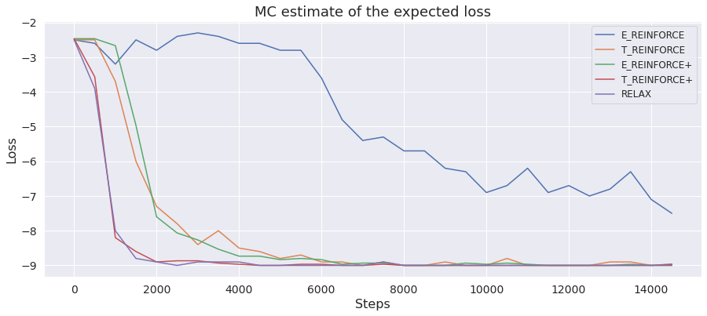

# Arborescence

This folder contains the implementation of `f_struct`, `f_log_prob` and `f_cond` for arborescence. `f_struct` applies the Chu-Liu Edmonds' algorithm that returns the minimal spanning arborescence of the weighted directed graph along with its execution trace. `f_log_prob` calculates the log probability of the execution trace and `f_cond` returns a sample from the conditional distribution of exponential variables given the execution trace.

Chu-Liu Edmonds' algorithm is implemented in C++. To compile and install it, go to the folder `edmonds` and run:
```
python setup.py install
```
Toy experiment consists in optimizing a vector of parameters of exponentials with respect to the loss function, that is equal to the expected negative maximal number of outgoing edges amond all the vertices in the arborescence. The optimal configuration of the arborescence is the graph in which all the edges come from the root. 

<p align="middle">
	
</p>

The plot above shows the performance of different gradient estimators on the described optimization problem with dimension size equal to `10` and `15000` gradient updates. Each gradient estimator uses `3` MC samples: 

* `E_reinforce`, `T_reinforce` and `relax` are calculated as the empirical average of the independent estimates;
* `E_reinforce+` and `T_reinforce+` use 3 samples for constructing leave-one-out baselines.

To obtain the plot, launch the `plot_toy_arborescence.ipynb` after running the following commands:
```
python toy_experiment.py --dim 10 --iters 15000 --lr 0.01 --estimator E_reinforce --num_samples 3 --plus_samples 1 
python toy_experiment.py --dim 10 --iters 15000 --lr 0.01 --estimator E_reinforce --num_samples 1 --plus_samples 3
python toy_experiment.py --dim 10 --iters 15000 --lr 0.01 --estimator T_reinforce --num_samples 3 --plus_samples 1 
python toy_experiment.py --dim 10 --iters 15000 --lr 0.01 --estimator T_reinforce --num_samples 1 --plus_samples 3
python toy_experiment.py --dim 10 --iters 15000 --lr 0.01 --estimator relax --num_samples 3 --plus_samples 1
```
