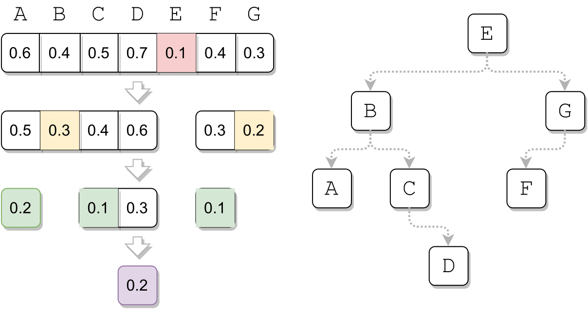
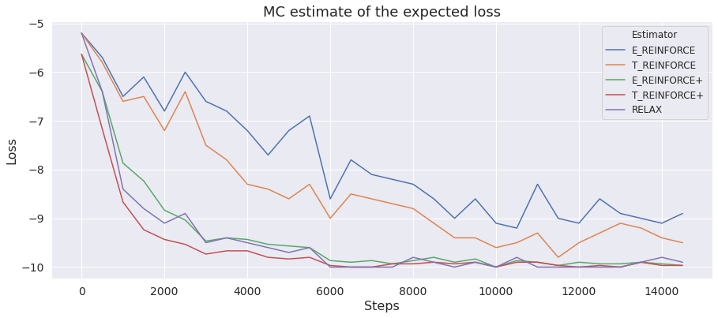

# Binary tree

This folder contains the implementation of `f_struct`, `f_log_prob` and `f_cond` for binary tree. `f_struct` applies the divide-and-conquer algorithm from the paper that finds argminimum in the array and makes the recursive call to the subarrays at the left and at the right of it. `f_log_prob` calculates the log probability of the binary tree and `f_cond` returns a sample from the conditional distribution of exponential variables given the binary tree. 
Note: here the execution trace `T` and the binary tree `X` are in one-to-one correspondance.

<p align="middle">
	
</p>

Toy experiment consists in optimizing a vector of parameters of exponentials with respect to the loss function, that is equal to the expected negative height of the binary tree. The optimal configuration of the binary tree is the list (left-to-right or right-to-left).

<p align="middle">
	
</p>

The plot above shows the performance of different gradient estimators on the described optimization problem with dimension size equal to `10` and `15000` gradient updates. Each gradient estimator uses `3` MC samples at training: 

* `E_reinforce`, `T_reinforce` and `relax` are calculated as the empirical average of the independent estimates;
* `E_reinforce+` and `T_reinforce+` use 3 samples for constructing leave-one-out baselines.

To obtain the plot, go to the folder `toy_experiment` and launch the `plot_toy_binary_tree.ipynb` after running the following commands:
```
python toy_experiment.py --dim 10 --iters 15000 --lr 0.01 --estimator E_reinforce --num_samples 3 --plus_samples 1 
python toy_experiment.py --dim 10 --iters 15000 --lr 0.01 --estimator E_reinforce --num_samples 1 --plus_samples 3
python toy_experiment.py --dim 10 --iters 15000 --lr 0.01 --estimator T_reinforce --num_samples 3 --plus_samples 1 
python toy_experiment.py --dim 10 --iters 15000 --lr 0.01 --estimator T_reinforce --num_samples 1 --plus_samples 3
python toy_experiment.py --dim 10 --iters 15000 --lr 0.01 --estimator relax --num_samples 3 --plus_samples 1
```
