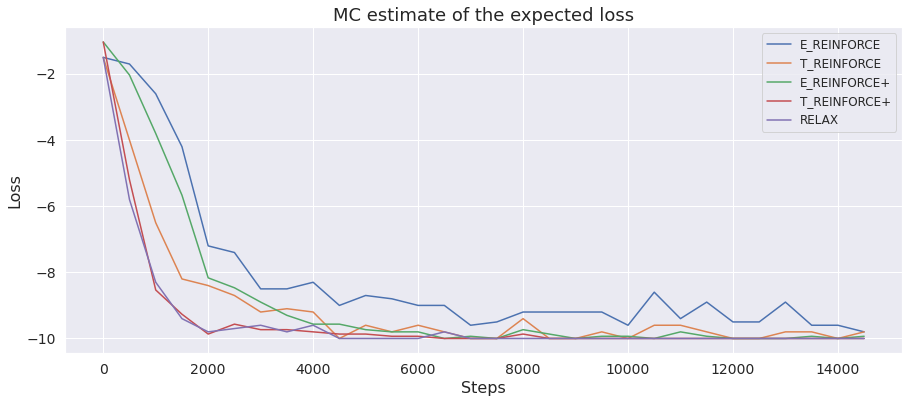

# Perfect matching

This folder contains the implementation of `f_struct`, `f_log_prob` and `f_cond` for perfect matching. `f_struct` applies the 'crossing' algorithm that recursively finds argminimum in the matrix and excludes the corresponding row and column. It returns the binary matrix corresponding to the matching along with the execution trace. `f_log_prob` calculates the log probability of the execution trace and `f_cond` returns a sample from the conditional distribution of exponential variables given the execution trace.

<p align="middle">
	
</p>

Toy experiment consists in optimizing a vector of parameters of exponentials with respect to the loss function, that is equal to the expected negative number of matching elements on the main diagonal. The optimal configuration of the perfect matching corresponds to the identity matrix.

<p align="middle">
	
</p>

The plot above shows the performance of different gradient estimators on the described optimization problem with dimension size equal to `10` and `15000` gradient updates. Each gradient estimator uses `3` MC samples at training: 

* `E_reinforce`, `T_reinforce` and `relax` are calculated as the empirical average of the independent estimates;
* `E_reinforce+` and `T_reinforce+` use 3 samples for constructing leave-one-out baselines.

To obtain the plot, go to the folder `toy_experiment` and launch the `plot_toy_matching.ipynb` after running the following commands:
```
python toy_experiment.py --dim 10 --iters 15000 --lr 0.01 --estimator E_reinforce --num_samples 3 --plus_samples 1 
python toy_experiment.py --dim 10 --iters 15000 --lr 0.01 --estimator E_reinforce --num_samples 1 --plus_samples 3
python toy_experiment.py --dim 10 --iters 15000 --lr 0.01 --estimator T_reinforce --num_samples 3 --plus_samples 1 
python toy_experiment.py --dim 10 --iters 15000 --lr 0.01 --estimator T_reinforce --num_samples 1 --plus_samples 3
python toy_experiment.py --dim 10 --iters 15000 --lr 0.01 --estimator relax --num_samples 3 --plus_samples 1
```
